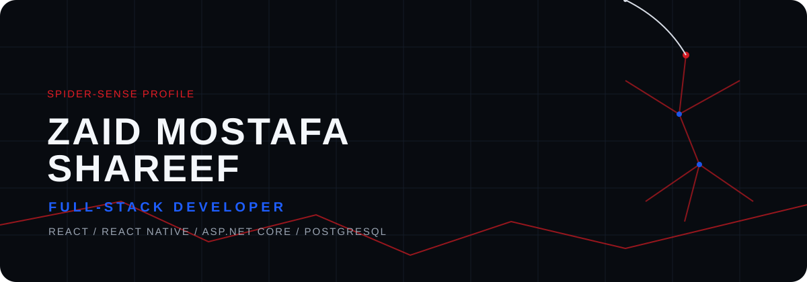
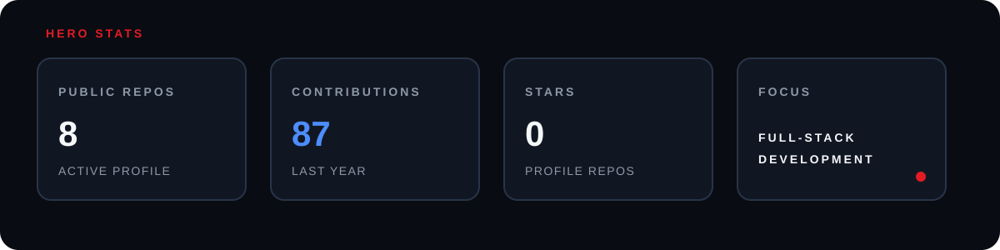
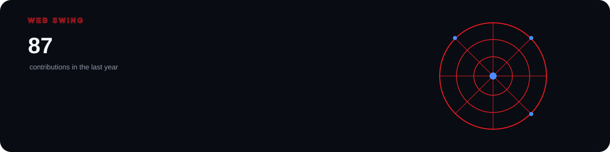
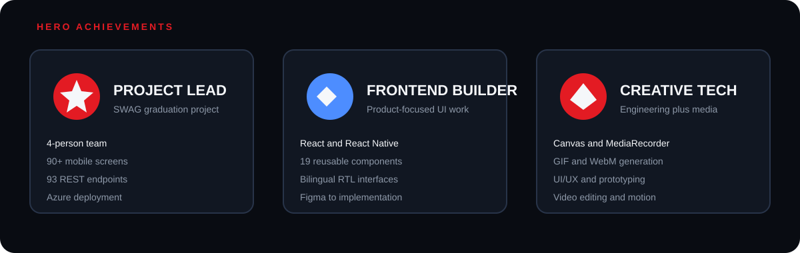
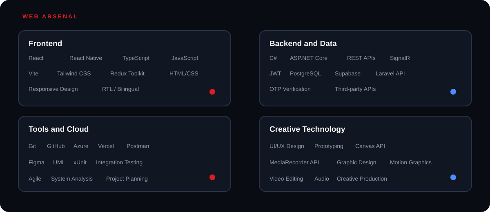
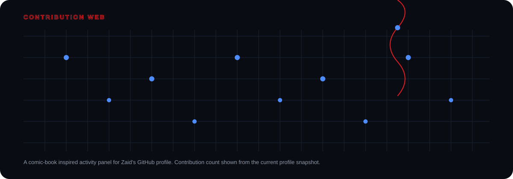

## Missions

### SWAG — Smart Automotive Platform

A mobile platform connecting car owners with verified automotive vendors.

**React Native · ASP.NET Core · PostgreSQL · SignalR · JWT · Azure**

* 90+ mobile screens
* Customer, Vendor, and Admin roles
* Real-time chat and notifications
* OTP verification
* AI-powered Car Assistant
* 93 REST endpoints
* 31 database tables
* Azure deployment
* 33-test xUnit suite

[View Project](https://github.com/Marah-Eid/SWAG-App)

### Waves E-Commerce

A bilingual Arabic and English e-commerce frontend with full RTL support.

**React · Vite · Tailwind CSS · Axios · Laravel REST API**

* 23 pages
* 19 reusable components
* Product filtering
* Cart and checkout flows
* Admin dashboard
* Arabic and English support
* Full RTL interface
* REST API integration

### SpinProduct

A browser-based 360-degree product showcase tool for social-media product sellers.

**React · Vite · Tailwind CSS · Canvas API · MediaRecorder API · Gemini Veo**

* 60-frame product rotation
* Lighting and shadow controls
* Rotation speed and direction controls
* WebM video export
* Custom GIF generation
* Instagram post, story, and square formats
* AI-generated video integration

### TaskPro

A responsive task management dashboard with authentication, CRUD functionality, search, and filtering.

**React · Vite · Tailwind CSS · Axios · Laravel REST API**

* Protected admin routes
* CRUD task management
* Search and filtering
* Bearer token authentication
* Session timeout handling
* Mock and live API modes

## About

Software Engineering graduate and Full-Stack Developer focused on modern web and mobile applications.

Primary development areas:

* React and React Native
* ASP.NET Core and REST APIs
* PostgreSQL and Supabase
* UI/UX and Figma
* Git, GitHub, Azure, Vercel, and Postman
* System analysis, UML, testing, and Agile development

## Connect

 

